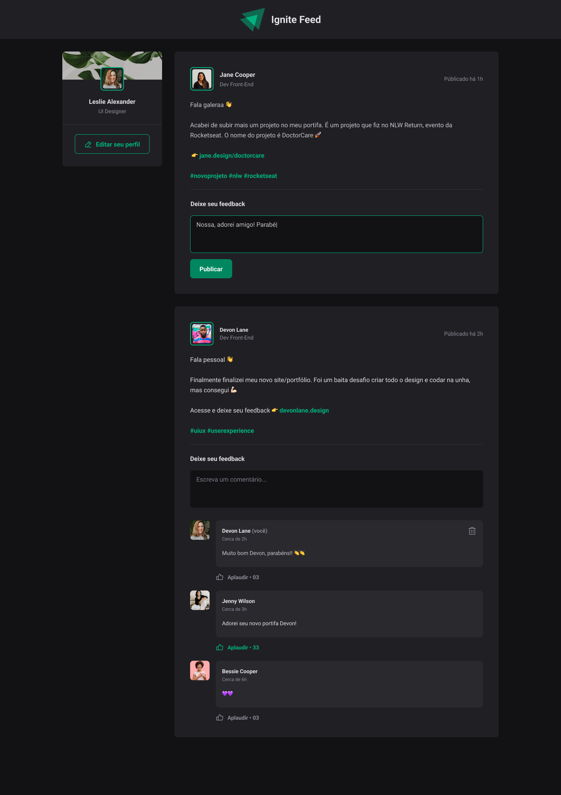

<div align="center">
     
</div>

---

## 💻 Projeto

Projeto desenvolvido no curso Ignite da @rocketseat. Trata-se de um feed onde podemos comentar nas postagens e interagir com os comentários. Podemos deletar os comentários se preferir.

## Começando...

Instale as dependências com:

```bash
npm install
# ou
yarn
```

## Iniciando o projeto

Execute o projeto com:

```bash
npm run dev
# ou
yarn dev
```

## A aplicação tem como objetivo reforçar fundamentos do ReactJS como:

- Estado
- Componentização
- Propriedades
- Comunicação entre componentes
- Imutabilidade
- Programação declarativa
- Percorrer um array com a função map do javascript
- Validação de formulário

## 🚀 Tecnologias

Esse projeto foi desenvolvido com as seguintes tecnologias:

- Vite
- React Js
- Typescript
- Formatação de datas com date fns
- css modules
